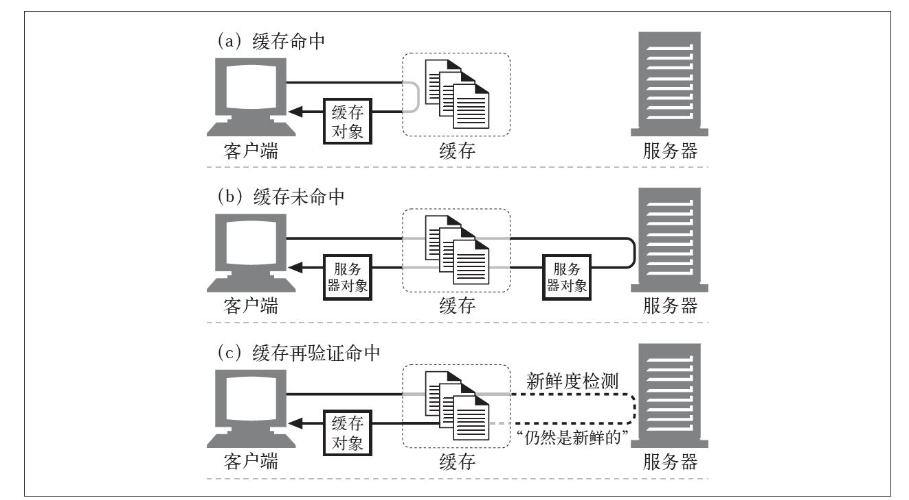
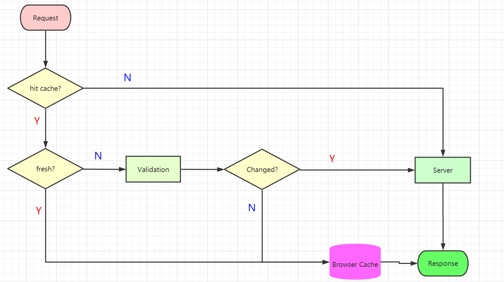
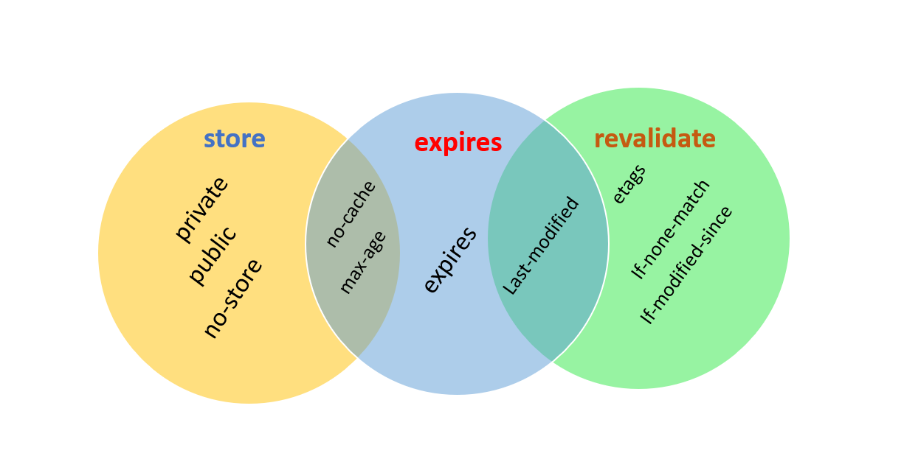
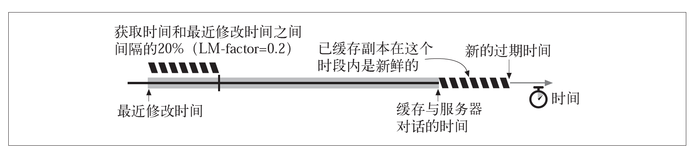

# HTTP CACHING

> *Cache* is a hardware or software component that stores data so that future requests for that data can be served faster.
>
> ### Notes:
>
> - Can someone use HTTP caching before?
>
> - Can anyone explain what's the role of 304 HTTP status code?

------

## AGENDA

- Why we use caching?
- HTTP Caching flow?
- HTTP Caching mechanism: storeage, expired, revalidate
- Heuristic Expiration
- Demo

------

## STARTING FROM A QUESTION


We get the response headers when we request this image

```http
HTTP/1.1 200 OK
content-length: 39409
last-modified: Thu, 14 May 2020 14:29:20 GMT
x-response-time: 7ms
```

------

### TWO QUESTIONS

- What will happen when we refresh the button? Is any cache could we use?
- If we set a header with `cache-control: no-cache`, What will happen when we refresh it agian?

------

## WHY USE CACHING

- Redundant Data Transfers
- Bandwidth Bottlenecks
- Flash Crowds
- Distance Delays

------


## CACHING STATES



------

## CACHING PROCESS FLOW



------

## HTTP CACHE MECHANISM



------

## Henuristic Expiration



------

## 👨‍🎓 DEMO👩‍🎓

> The task:
>
> - Write a `send` function which handle revalidate logical

```js
function send(req, res) {
    // generate etag
    
    // revalidate - 304
}
```


------

## THANK YOU

**Useful links && reference**

- https://tools.ietf.org/html/rfc2616#section-14.9
- https://tools.ietf.org/html/rfc7234
- [HTTP Definitive Guide](https://www.amazon.com/HTTP-Definitive-Guide-Guides/dp/1565925092)
- https://developer.mozilla.org/zh-CN/docs/Web/HTTP/Headers/Cache-Control

